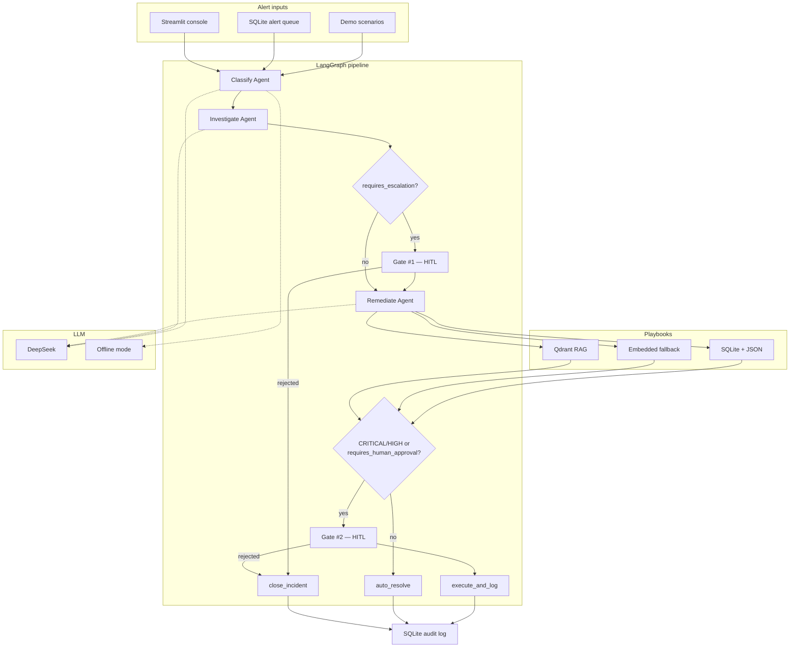
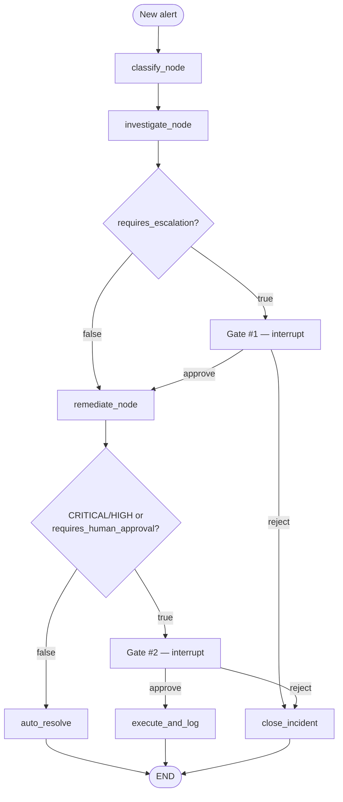

# LangGraph AI SOC Triage

AI multi-agent incident triage with playbook-guided remediation and **deterministic human-in-the-loop (HITL) gates** before high-risk steps. Built with **LangGraph** — classify → investigate → remediate — with typed **Pydantic** outputs for audit and downstream automation.

---

## Problem Statement

SOC analysts and incident responders face alert fatigue: triage is manual, inconsistent, and tied to runbooks scattered across wikis and docs. AI can speed up classification and investigation, but letting an agent auto-execute remediation is risky — false positives can trigger host isolation, credential revocation, or firewall changes with no audit trail.

This project demonstrates a safer pattern: automate the **reasoning** workflow (Classify → Investigate → Remediate) grounded in incident-response playbooks, with **two code-enforced HITL gates** via LangGraph `interrupt()`. Gates fire on explicit rules (escalation flags, severity thresholds, approval flags), not on the LLM deciding whether to ask a human.

---

## Solution Overview

An alert enters a LangGraph `StateGraph` and flows through three LLM-backed agents. Each agent returns a Pydantic model (`Classification`, `Investigation`, `Remediation`). After investigation, if `requires_escalation` is set, the graph **pauses at Gate #1** for human approval. After remediation, if severity is CRITICAL/HIGH or `requires_human_approval` is set, the graph **pauses at Gate #2**. Low-risk paths skip gates and end in `auto_resolved`. Approved high-risk paths reach `execute_and_log` and are written to the audit trail.

Playbook context is injected into the Remediate agent via `knowledge_base.py`: ingested SQLite/JSON playbooks, embedded fallback playbooks, or Qdrant semantic search when enabled.

---

## Tech Stack

| Layer | Tool | Why |
|-------|------|-----|
| **Orchestration** | [LangGraph](https://github.com/langchain-ai/langgraph) | `StateGraph` with conditional routing and `interrupt()` for HITL pause/resume |
| **LLM integration** | [LangChain](https://github.com/langchain-ai/langchain) | Message types and structured-output wrappers for agent prompts |
| **Structured outputs** | [Pydantic](https://docs.pydantic.dev/) | Validated `Classification`, `Investigation`, `Remediation` models for routing and audit JSON |
| **Reasoning** | [DeepSeek API](https://platform.deepseek.com) | Default LLM via OpenAI-compatible `ChatOpenAI` |
| **Local LLM** | [Ollama](https://ollama.com) | Optional on-prem inference (`LLM_PROVIDER=ollama`) |
| **Persistence** | [SQLite](https://www.sqlite.org/) | Alerts, playbooks, and triage audit log — no separate DB server |
| **Playbook data** | [Hugging Face Datasets](https://huggingface.co/datasets) | Incident-response playbooks and synthetic SIEM alerts for ingest |
| **RAG** | [LlamaIndex](https://www.llamaindex.ai/) + [Qdrant](https://qdrant.tech/) | Optional semantic playbook retrieval over a local vector index |
| **UI** | [Streamlit](https://streamlit.io/) | Alert queue, triage runs, HITL approve/reject, audit log |
| **CLI** | [Rich](https://github.com/Textualize/rich) | Demo runner and terminal approval prompts |
| **Safety** | `src/guardrails/` | Regex checks on alert input and remediation output |
| **Tests** | [pytest](https://pytest.org/) | Graph routing and agent logic without live LLM calls (`OFFLINE_MODE`) |

```bash
pip install -e ".[dev]"              # core + tests
pip install -e ".[ui]"               # Streamlit + HF ingest
pip install -e ".[rag]"              # LlamaIndex + Qdrant
pip install -e ".[local]"            # Ollama
pip install -e ".[all]"              # everything
```

---

## Architecture

### System context



Diamond nodes are **deterministic Python routing** in `src/graph.py`. Gate nodes call LangGraph `interrupt()` and wait for human approval via CLI or Streamlit.

### Triage workflow



---

## How It Works

### Agents

| Agent | Output | Role |
|-------|--------|------|
| **Classifier** | `Classification` | Severity, category, confidence, reasoning |
| **Investigator** | `Investigation` | Findings, scope, IOCs, `requires_escalation` |
| **Remediator** | `Remediation` | Immediate/long-term actions, `requires_human_approval` |

Set `OFFLINE_MODE=true` to run deterministic mocks in `src/offline.py` (no API key).

### HITL gates

| Gate | Fires when | Approve | Reject |
|------|------------|---------|--------|
| **#1** | `investigation.requires_escalation` | Continue to Remediate | `close_incident` |
| **#2** | Severity CRITICAL/HIGH, or `remediation.requires_human_approval` | `execute_and_log` | `close_incident` |

Approval via CLI (default) or Streamlit. Resume a paused CLI run:

```bash
python -m src.resume --run-id <thread_id> --decision approve
```

### Playbook retrieval

Lookup order in `knowledge_base.py`:

1. Ingested playbooks — SQLite + `data/playbooks.json`
2. Qdrant RAG — when `RAG_ENABLED=true` and `[rag]` extras installed
3. Embedded `PLAYBOOKS` dict — built-in fallback

---

## Quick Start

### Install

```bash
pip install -e ".[dev]"
cp .env.example .env
```

Set your DeepSeek API key in `.env`:

```env
LLM_PROVIDER=deepseek
DEEPSEEK_API_KEY=sk-your-key-here
DEEPSEEK_MODEL=deepseek-chat
OFFLINE_MODE=false
```

### Tests (no API key)

```bash
OFFLINE_MODE=true RAG_ENABLED=false pytest -v
```

### CLI demo

```bash
python -m src.demo                      # interactive HITL prompts
python -m src.demo --auto-approve       # non-interactive
python -m src.demo --alert 0 --auto-approve
```

### Streamlit UI

```bash
pip install -e ".[ui]"
python scripts/ingest_alerts.py
streamlit run app/streamlit_app.py
```

### Ingest playbooks

```bash
python scripts/ingest_playbooks.py
```

Optional Qdrant index: `docker compose up -d qdrant` then `pip install -e ".[rag]"` and `python scripts/ingest_playbooks.py --qdrant`.

---

## Sample Scenarios

Six curated alerts in `src/scenarios.py`:

| # | Alert ID | Scenario | Gate #1 | Gate #2 |
|---|----------|----------|---------|---------|
| 0 | ALT-2026-0847 | Data exfiltration (Tor → PII S3) | Yes | Yes |
| 1 | ALT-2026-0848 | Security group SSH 0.0.0.0/0 | No | No |
| 2 | ALT-2026-0849 | WAF SQLi scan (all blocked) | No | No |
| 3 | ALT-2026-0850 | Ransomware on endpoint | Yes | Yes |
| 4 | ALT-2026-0851 | Lateral movement via RDP | Yes | Yes |
| 5 | ALT-2026-0852 | External vuln scan (all blocked) | No | No |

Use `OFFLINE_MODE=true` for deterministic gate behavior in tests.

---

## Project Structure

```
app/streamlit_app.py       # SOC analyst console
src/
├── graph.py               # LangGraph workflow + HITL interrupts
├── agents.py              # Classify, investigate, remediate
├── models.py              # Pydantic models
├── knowledge_base.py      # Playbook retrieval
├── llm.py                 # DeepSeek / Ollama / offline mode
├── demo.py                # CLI demo
├── db.py                  # SQLite alerts, playbooks, audit log
├── hitl/                  # CLI approval backend
├── guardrails/            # Input/output safety checks
└── rag/                   # Qdrant vector store
scripts/
├── ingest_playbooks.py
└── ingest_alerts.py
tests/
```

---

## Configuration

| Variable | Default | Purpose |
|----------|---------|---------|
| `LLM_PROVIDER` | `deepseek` | `deepseek` or `ollama` |
| `DEEPSEEK_API_KEY` | — | API key for live runs |
| `OFFLINE_MODE` | `false` | Deterministic mocks for tests |
| `USE_INGESTED_PLAYBOOKS` | `true` | Prefer SQLite-ingested playbooks |
| `RAG_ENABLED` | `true` | Use Qdrant when available |
| `SQLITE_DB` | `data/triage.db` | Database path |
| `SIEM_ALERT_LIMIT` | `5000` | Max alerts to ingest |

---

## Portfolio deploy (Streamlit Cloud)

This app is portfolio-ready on [Streamlit Community Cloud](https://streamlit.io/cloud) — no VPS or database server required.

**What visitors can try**
- **Curated Demos** — six enterprise scenarios with real HITL approve/reject in the UI
- **Triage pipeline** — Classify → Investigate → Remediate with LangGraph `interrupt()` gates
- **Audit Log** — triage runs saved for the current session

You do **not** need the Alert Queue or persistent SQLite for a strong portfolio demo. Curated Demos + embedded playbooks are enough.

**Deploy steps**

1. Push this repo to GitHub (public repo for free tier).
2. [share.streamlit.io](https://share.streamlit.io) → **New app** → select repo.
3. Main file path: `app/streamlit_app.py`
4. **Secrets** (Settings → Secrets) — free demo, no API cost:

   ```toml
   OFFLINE_MODE = "true"
   RAG_ENABLED = "false"
   ```

   For live DeepSeek reasoning, set `OFFLINE_MODE = "false"` and add `DEEPSEEK_API_KEY`.

5. Deploy. Link the live URL in your resume and README.

**Note:** Streamlit Cloud uses an ephemeral filesystem — audit log and alert queue reset on redeploy. That is fine for portfolio; lead visitors to **Curated Demos**.

---

## Data sources

Public Hugging Face datasets used for playbook ingest and the synthetic SIEM alert queue:

- [Incident Response Playbook Dataset](https://huggingface.co/datasets/darkknight25/Incident_Response_Playbook_Dataset) — playbook ingest (`scripts/ingest_playbooks.py`)
- [Advanced SIEM Dataset](https://huggingface.co/datasets/darkknight25/Advanced_SIEM_Dataset) — alert queue (`scripts/ingest_alerts.py`)

Curated demo scenarios in `src/scenarios.py` are designed for this project’s HITL gate demonstrations.
